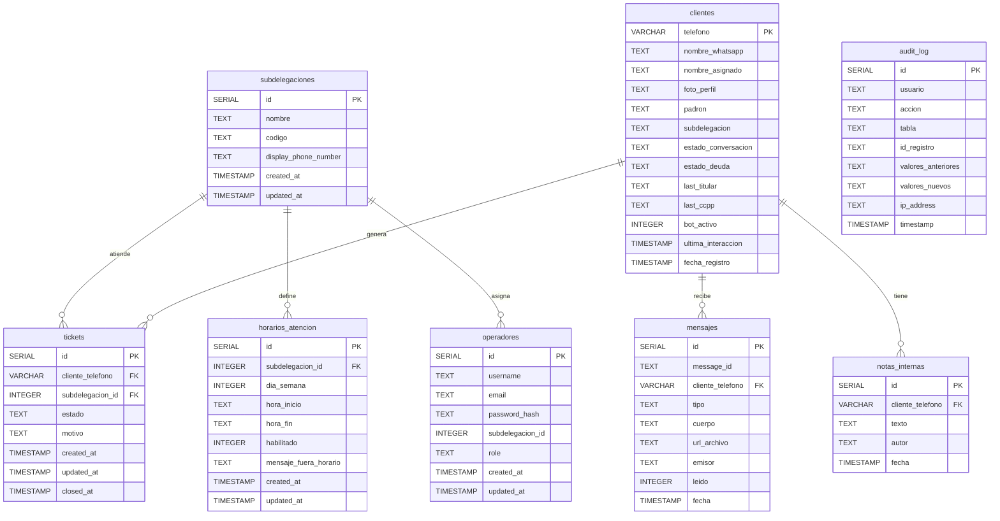

# Esquema Base de Datos - Bot Irrigación

Base de datos PostgreSQL dedicada al proyecto. El modelo actual está centrado en:

- `subdelegaciones`: zonas/centros operativos
- `clientes`: registros de contacto y estado conversacional
- `tickets`: derivaciones o pedidos para atención humana
- `horarios_atencion`: disponibilidad por día y subdelegación
- `mensajes`: historial de mensajes entrantes/salientes
- `notas_internas`: notas privadas de operadores
- `operadores`: usuarios del panel / login
- `audit_log`: auditoría de cambios

## Resumen funcional

- `subdelegaciones`: identifica la zona operativa y el número asociado.
- `clientes`: guarda el teléfono, datos de padrón y estado actual de la conversación.
- `tickets`: registra derivaciones a operador y casos abiertos.
- `horarios_atencion`: controla si hay operadores disponibles por día.
- `mensajes`: historial de mensajes para el panel y trazabilidad.
- `notas_internas`: observaciones privadas del equipo.
- `operadores`: credenciales del panel, con posible asignación a subdelegación.
- `audit_log`: auditoría de acciones administrativas.

Relaciones principales:
- `clientes` → `mensajes`
- `clientes` → `tickets`
- `clientes` → `notas_internas`
- `subdelegaciones` → `operadores`
- `subdelegaciones` → `tickets`
- `subdelegaciones` → `horarios_atencion`
